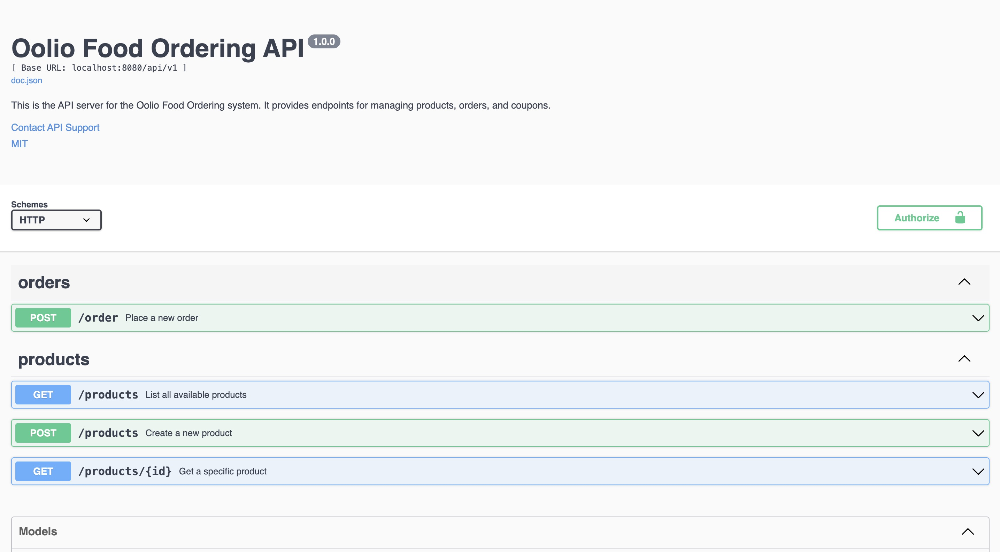
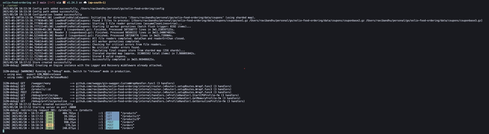

# Oolio Food Ordering API

A scalable, maintainable Go API for food ordering, designed with modular architecture and best practices. This project provides endpoints for product listing, order placement, and promo code validation, with a focus on extensibility, robust validation, and production-readiness.

## Features
- RESTful API with OpenAPI/Swagger documentation
- Product listing and retrieval
- Order placement with promo code validation
- Concurrent promo code processing system
- Configurable logging and server settings
- Production-ready error handling
- API key authentication

## Table of Contents
1. [Getting Started](#getting-started)
2. [API Documentation](#api-documentation)
3. [Promo Code System](#promo-code-system)
4. [Configuration](#configuration)
5. [Testing](#testing)
6. [API Verification](#api-verification)

## Getting Started

### Prerequisites
- Go (version 1.18 or higher)
- Git

### Installation
1. Clone the repository:
   ```bash
   git clone <repository-url>
   cd oolio-food-ordering
   ```

2. Install dependencies:
   ```bash
   go mod tidy
   ```

3. Build the application:
   ```bash
   go build ./cmd/server
   ```

4. Run the server:
   ```bash
   ./server
   ```

The server will start on port 8080 by default.

## API Documentation

### Swagger/OpenAPI Documentation
Access the interactive API documentation at:
```
http://localhost:8080/swagger/index.html
```

### Available Endpoints

#### Products
- `GET /api/v1/products` - List all products
- `GET /api/v1/products/{id}` - Get product by ID
- `POST /api/v1/products` - Create new product (admin only)

#### Orders
- `POST /api/v1/orders` - Place a new order

### Authentication
API uses X-API-Key header for authentication:
```
X-API-Key: your-api-key
```

## Promo Code System

### Overview
The system efficiently processes multiple large input files containing promo codes, identifying valid codes based on specific criteria:
- Length between 8-10 characters (inclusive)
- Present in at least two input files

### Key Features
- Parallel file ingestion (plain text or gzipped)
- Concurrent processing with worker pools
- Memory-efficient occurrence tracking using bitmasks
- Sharded map implementation for reduced lock contention
- Configurable validation rules

### Technical Implementation

#### Concurrent Processing Pipeline
1. **Parallel File Reading**
   - Multiple goroutines read files simultaneously
   - Supports both plain text and gzipped files

2. **Worker Pool Processing**
   - Dynamic worker pool based on CPU cores
   - Local batching for reduced contention
   - Pipeline-based data flow

3. **Efficient Data Structures**
   - Bitmask tracking for file occurrence
   - Sharded concurrent map implementation
   - Memory-optimized data flow

#### Usage
Place coupon files in the configured directory:
```bash
data/coupons/
├── couponbase1.gz
├── couponbase2.gz
└── couponbase3.gz
```

## Configuration

### Environment Variables
- `CONFIG_PATH` - Path to configuration directory
- `SERVER_PORT` - Server port (default: ":8080")
- `LOG_LEVEL` - Logging level (default: "info")
- `LOG_FORMAT` - Log format ("json" or "text")

### Configuration File (config.yaml)
```yaml
server:
  port: ":8080"
  read_timeout: "15s"
  write_timeout: "15s"
  idle_timeout: "60s"

files:
  products_file: "data/products.json"
  coupons_dir: "data/coupons"

logging:
  level: "info"
  format: "json"
```

## Testing

### Running Tests
Run all tests:
```bash
go test ./...
```

Run specific package tests:
```bash
go test ./internal/data/...
go test ./internal/services/...
```

### Test Coverage
Generate test coverage report:
```bash
go test -coverprofile=coverage.out ./...
go tool cover -html=coverage.out
```

## API Verification

### Tools Used
- **Postman**: API testing and collection management
- **curl**: Command-line testing
- **httptest**: Integration testing
- **Swagger UI**: API documentation and testing





## License
MIT